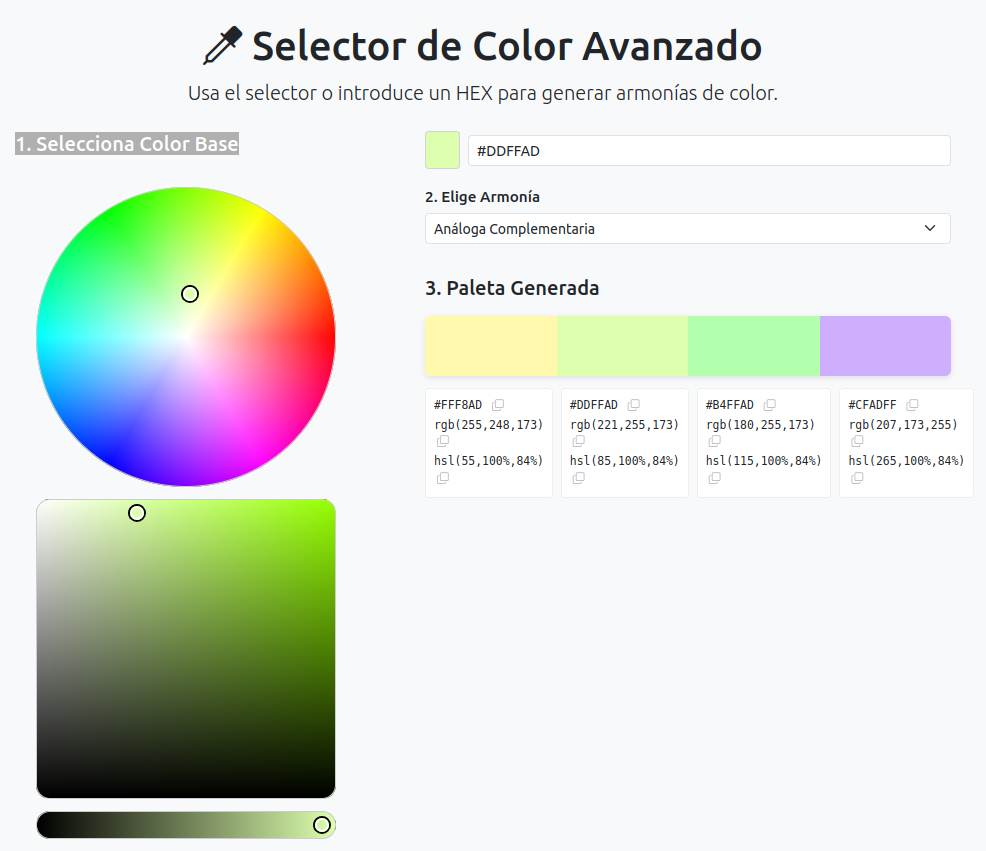
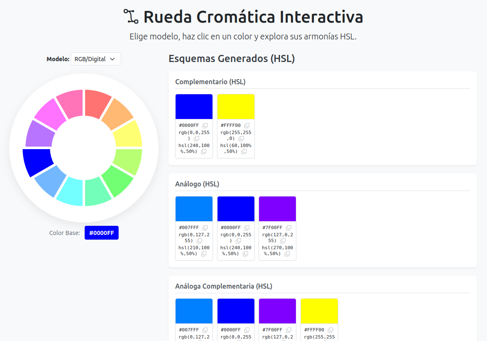

# 🎨 Color Harmony Picker

[](https://opensource.org/licenses/MIT) [](https://soyunomas.github.io/color-harmony-picker/selector_avanzado.html) [](https://soyunomas.github.io/color-harmony-picker/rueda_cromatica.html)

Una colección de herramientas web interactivas diseñadas para ayudar a diseñadores y desarrolladores a explorar y generar armonías de color fácilmente. ✨

## 📝 Descripción Breve

Este proyecto ofrece dos interfaces distintas para trabajar con paletas de colores:

1.  Una **Rueda Cromática Interactiva** que permite seleccionar colores base de modelos RGB o RYB y visualiza *todas* las armonías HSL estándar simultáneamente.
2.  Un **Selector de Color Avanzado** que proporciona un selector de color más preciso (rueda/caja/slider) y permite elegir *una armonía específica* para generar y visualizar la paleta resultante.

Ambas herramientas facilitan la copia de los códigos de color (HEX, RGB, HSL) para su uso inmediato.

## 🖼️ Captura de Pantalla / Demo





Puedes probar las demos en vivo aquí:

*   **[Demo - Selector Avanzado](https://soyunomas.github.io/color-harmony-picker/selector-avanzado.html)**
*   **[Demo - Rueda Cromática](https://soyunomas.github.io/color-harmony-picker/rueda-cromatica.html)**

## ✨ Características Principales

*   **🎨 Múltiples Métodos de Selección:** Elige colores base mediante una rueda SVG discreta, un selector iro.js avanzado o introduciendo directamente un código HEX.
*   **🌈 Modelos de Color:** Soporte para modelos RGB (Digital) y RYB (Tradicional) en la herramienta de rueda cromática.
*   **⚖️ Generación de Armonías:** Calcula y muestra esquemas de color estándar:
    *   Complementario
    *   Análogo
    *   Análogo Complementario
    *   Triádico
    *   Complementario Dividido
    *   Tetrádico
    *   Cuadrado
    *   Monocromático
*   **👁️ Visualización Flexible:**
    *   Visualiza *todas* las paletas generadas a la vez (herramienta Rueda).
    *   Visualiza una paleta *seleccionada* con una barra de previsualización y detalles (herramienta Selector Avanzado).
*   **📋 Información Detallada:** Muestra los códigos HEX, RGB y HSL para cada color en las paletas generadas.
*   **🖱️ Copiar Fácilmente:** Botones para copiar cualquier código de color al portapapeles con un solo clic.
*   **📱 Interfaz Amigable:** Diseño limpio y responsivo utilizando Bootstrap 5.
*   **🧩 Dos Herramientas en Una:** Ofrece dos enfoques diferentes para la exploración de colores dentro del mismo proyecto.

## 🛠️ Tecnologías Utilizadas

*   **HTML5:** Estructura semántica.
*   **CSS3:** Estilos personalizados y layout (Flexbox).
*   **Bootstrap 5.3.2:** Framework CSS/JS para diseño responsivo y componentes UI.
*   **Bootstrap Icons:** Iconografía vectorial.
*   **JavaScript (ES6+):** Lógica de la aplicación, manipulación del DOM, cálculos de color y interacción.
*   **SVG:** Para la creación dinámica de la rueda cromática interactiva.
*   **iro.js v5:** Librería JavaScript para el selector de color avanzado.
*   **CDNs:** Todas las librerías externas (Bootstrap, iro.js) se cargan desde CDNs.

## 🚀 Instalación / Visualización Local

Para ejecutar este proyecto en tu máquina:

1.  **Clona el repositorio:**
    ```bash
    git clone https://github.com/soyunomas/color-harmony-picker.git
    ```
2.  **Navega al directorio del proyecto:**
    ```bash
    cd color-harmony-picker
    ```
3.  **Abre los archivos HTML:**
    *   Para usar la Rueda Cromática: Abre el archivo `rueda-cromatica.html` (o como lo hayas renombrado) en tu navegador web.
    *   Para usar el Selector Avanzado: Abre el archivo `selector-avanzado.html` (o como lo hayas renombrado) en tu navegador web.
4.  **🌐 Conexión a Internet:** Necesaria para cargar las librerías de Bootstrap e iro.js desde sus CDNs.
5.  **(Sin Dependencias Adicionales):** No se requieren permisos de cámara ni archivos de recursos locales adicionales.

## 🕹️ Cómo Usar

**1. Rueda Cromática Interactiva (`rueda-cromatica.html`):**

*   Selecciona el modelo de color (RGB o RYB) usando el desplegable.
*   Haz clic en un segmento de color de la rueda SVG.
*   El color base seleccionado se mostrará.
*   Debajo aparecerán automáticamente todas las paletas de armonía generadas (Complementario, Análogo, etc.).
*   Cada color en las paletas muestra sus códigos HEX, RGB y HSL.
*   Usa los iconos <i class="bi bi-copy"></i> para copiar el código deseado al portapapeles.

**2. Selector de Color Avanzado (`selector-avanzado.html`):**

*   Usa el widget de iro.js (rueda, caja, slider) para seleccionar un color base.
*   Alternativamente, puedes escribir un código HEX válido en el campo de texto (el picker se actualizará).
*   Elige el tipo de armonía que deseas generar usando el menú desplegable "Elige Armonía".
*   La paleta resultante se mostrará en la barra de previsualización y en los bloques de información detallada debajo.
*   Usa los iconos <i class="bi bi-copy"></i> junto a cada código (HEX, RGB, HSL) para copiarlo.

## 📄 Licencia

Este proyecto está bajo la Licencia MIT.
[](https://opensource.org/licenses/MIT)

## 🧑‍💻 Contacto

Creado por **soyunomas** ([@soyunomas en GitHub](https://github.com/soyunomas))

---
